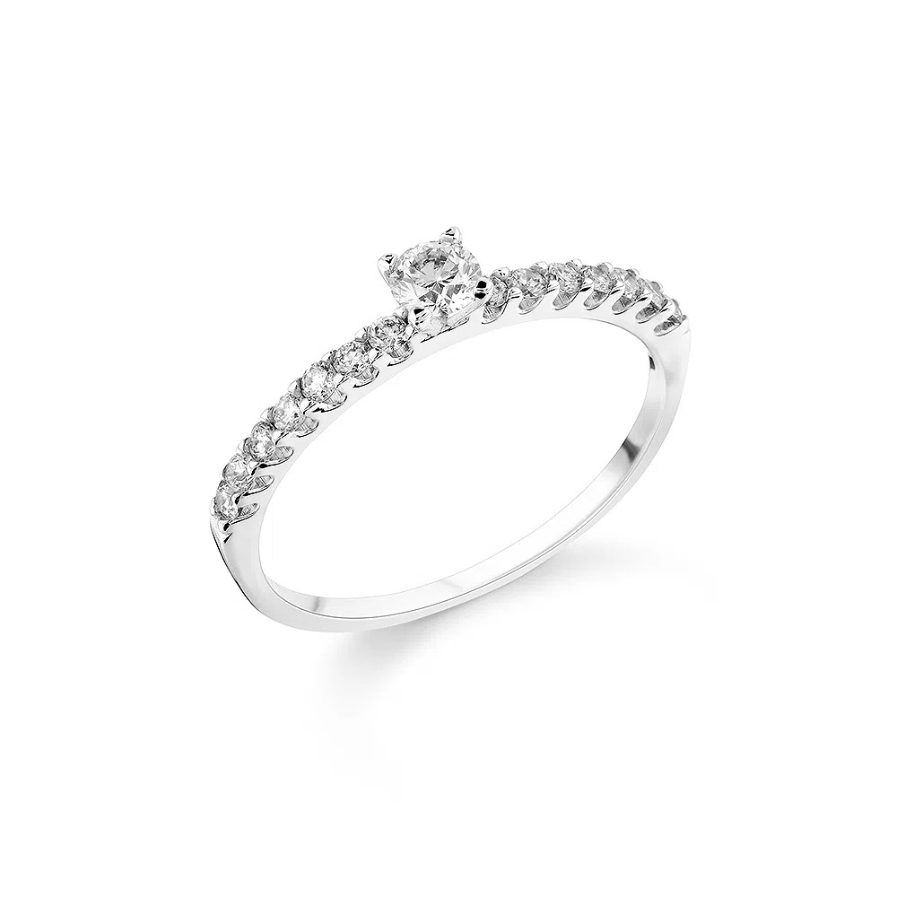

<h1> SOBRE O SITE DE PRODUTO </h1>

* <h4> Nesse site encontramos diversos tipos de joias e de marcas como: </h4>
* <h2> Anel da Vivara </h2> 

* <h2> Colar Tiffany </h2> 

* <h2> Bracelete da Pandora </h2>  

img {width: 10%;
    position: absolute;
    left: 1200px;
    top: 150px;
    border-radius: 50%;}
* <h4> como podemos utilizar esse site </h4> 
* Podemos usar esse site para comprar joias

* foi utilizado os seguintes comandos 
* css 
* html 